# TransitAI UTM - Administrator Manual

Web-Based Campus Transport Chatbot Prototype
MECS0033-52 Artificial Intelligence, Section 52, Group 5

This is the separate Administrator Manual deliverable. The in-app Staff Demo screen is a control surface for demonstration and proof execution; it does not replace this Word manual.

| Manual item | Description |
| --- | --- |
| Audience | Lecturer, marker, transport administrator, or maintainer reviewing the prototype. |
| Prototype path | MECS0033-52/Group5Asg1/prototype/index.html |
| Run mode | Open index.html directly, or run python3 -m http.server 8000 from the prototype folder. |
| Main grading evidence | Interactive screen, problem-solving workflow, administrator process, screenshots, and resolution proof. |
| Data boundary | Public route names/stop sequences are used where available; timetable, ETA, delay state and walking notes are configured prototype estimates. |

## 1. Purpose and Rubric Alignment

TransitAI UTM turns the project report into an inspectable browser prototype. The marker can click through the phone-style app, ask transport questions, change demo time, create feedback reports, toggle staff delays, and inspect the AI reasoning evidence.

| Rubric criterion | How the prototype supports full marks | Where to verify |
| --- | --- | --- |
| Originality / Interactive Screen | Home navigation, chatbot input, intent confidence, RAG-style evidence, timetable search, full-day route timetable, subscription-filtered alerts, feedback escalation, Staff Control Panel, and visible AI pipeline. | Figures 1-13; index.html |
| Problem Solving | Addresses common campus transport pain points: route planning, next bus timing, arrival estimate, stop lookup, service delay notification, and passenger issue reporting. | Chat, Timetable, Alerts, Feedback |
| Admin Manual | Explains component map, truthful data policy, configuration, operating steps, proof procedure, troubleshooting, and screenshot-guided usage. | This ADMIN_MANUAL.docx |

## 2. Architecture and Component Map

The prototype is deliberately self-contained: HTML, CSS and vanilla JavaScript only. There is no Firebase, no server, no API key and no build step. This is appropriate for a 10 percent proof of concept because the AI workflow is visible and repeatable during marking.

| File | Main object | Important functions | Responsibility |
| --- | --- | --- | --- |
| js/kb.js | KB, KBUtil | findStop, findStops, routesServing, routesBetween, nextDeparture, setClock, subscribe, setDelayed, logFeedback | Knowledge base, route/stop lookup, directional route matching, timetable estimates, subscriptions, delays and feedback state. |
| js/intent.js | Intent | classify(query) | Scores six major intents and exposes confidence in the UI. |
| js/retriever.js | Retriever | retrieve(query, k) | RAG-style token retrieval over stops, routes, FAQs, alerts and source notes. |
| js/resolution.js | Resolution | prove(user, route) | First-order resolution-refutation proof for NotifyUser(user, route, delay). |
| js/chat.js | Chat | send(text), init() | Conversation controller, session memory, response cards and AI pipeline updates. |
| js/app.js | App | showScreen, showStop, showRouteTimetable, renderAlerts, renderAdmin, runProof | Screen routing, timetable, Alerts, Feedback, Staff Control Panel and proof display. |

Runtime flow: user question -> Intent.classify() -> Retriever.retrieve() -> per-intent response handler -> grounded UI card + AI pipeline panel. Staff delay flow: Staff Control Panel toggle -> KBUtil.setDelayed() -> Resolution.prove() -> Alerts screen for subscribed users only.

## 3. Data Source and Accuracy Policy

Use this explanation during presentation: route names and stop sequences are aligned to public UTM/DVC/KDOJ sources where available. Timetable, ETA, delay duration, operating state and walking notes are configured estimates for demonstrating the AI concept, because no verified live UTM shuttle feed is connected.

| Data shown | Status | Administrator explanation |
| --- | --- | --- |
| BAS A/B/C/D/E/F/G/H route labels and stop sequences | Public-list aligned | Used as route/sequence reference where public UTM/DVC/KDOJ listings are available. Do not claim they prove current live operation. |
| Stop labels such as CP, KP, K9/K10, KTC, KDOJ, KDSE, KTDI, N24, SKT, P19, T02, T08, V01 | Public stop labels | Used as route-stop codes because they appear in public route listings. |
| FKE mapping | Partially verified | Mapped to P19 / FKE Area because public listings include P19 and FKE-area stop references. Production should confirm exact shelter. |
| FC mapping | Prototype alias | Mapped to N24 / Cluster Area for the report demo. Exact current FC shuttle-stop mapping was not found. |
| PSZ Library | Landmark only | The app can identify PSZ as a campus landmark, but it does not invent a direct shuttle route to PSZ. |
| Next bus, full-day timetable, service window, ETA and delay duration | Prototype estimate | Calculated from configured operating windows/headways and demo time. Not an official live timetable. |
| Delay alert | Prototype estimate | Staff toggle represents transport staff publishing a disruption so the logic proof and alert workflow can be shown. |

Sources checked on 2 July 2026: UTM DVC Development shuttle bus schedule page, KDOJ UTM Bus Schedule route list, and the UTM JB 2025 shuttle timetable PDF.

## 4. Screenshot-Guided Operating Procedure

The following figures are current screenshots from the redesigned prototype. The arrows identify the control or evidence to point at during the presentation.

### 4.1 Home Screen and Navigation

1. Open index.html. Confirm the phone status clock is visible at the top right.
2. Use Home cards or the bottom tab bar to start the main workflows.
3. Keep the AI pipeline panel visible when explaining originality.

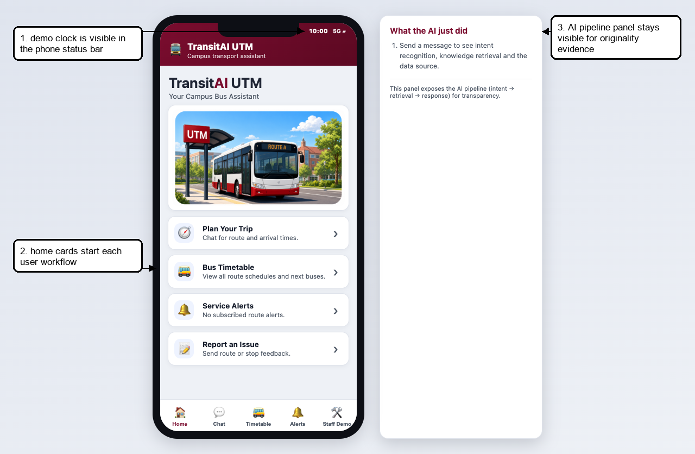
*Figure 1. Home screen with demo clock, navigation cards and AI pipeline panel.*

### 4.2 Chat Schedule Answer

1. Open Chat and ask: When is the next bus to FKE?
2. Point to intent confidence to show the intent recognition result.
3. Point to first bus, last bus, service window and frequency to show the app now behaves like a transport product.
4. Explain the source boundary: public route data plus configured timetable estimate.

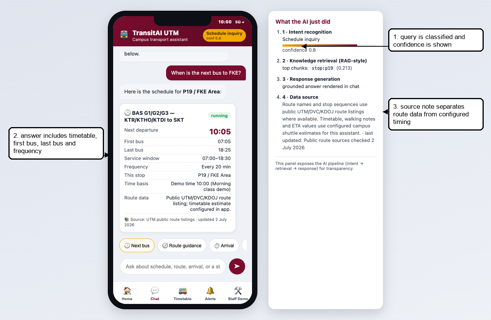
*Figure 2. Schedule card with first bus, last bus, service window, frequency and AI pipeline evidence.*

### 4.3 Timetable Search and Full-Day Route Timetable

1. Open Bus Timetable.
2. Search by route, stop or faculty alias, for example FKE.
3. Tap the BAS G route card to open its route timetable.
4. Scroll to show the full-day departure groups and the highlighted next bus.

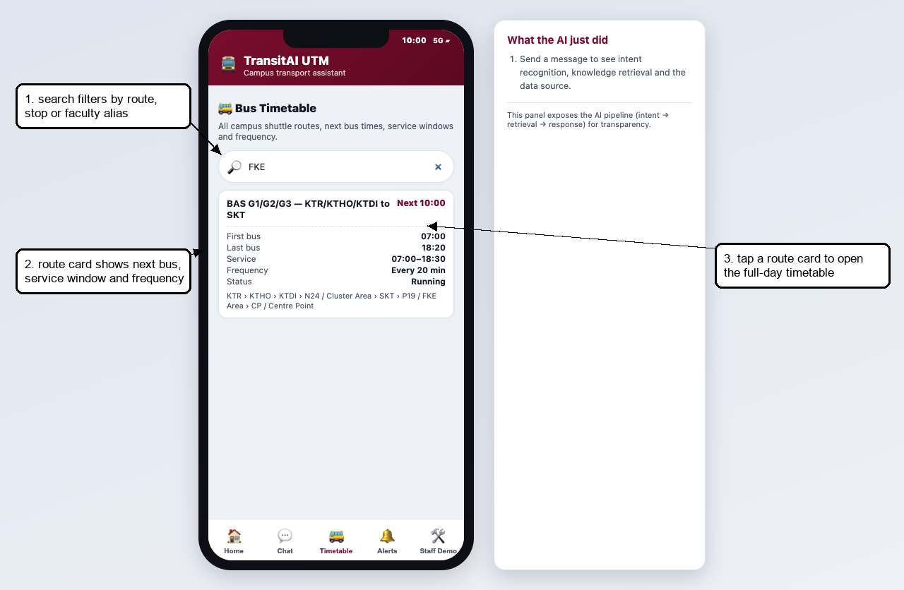
*Figure 3. Timetable search filtering routes by FKE alias.*

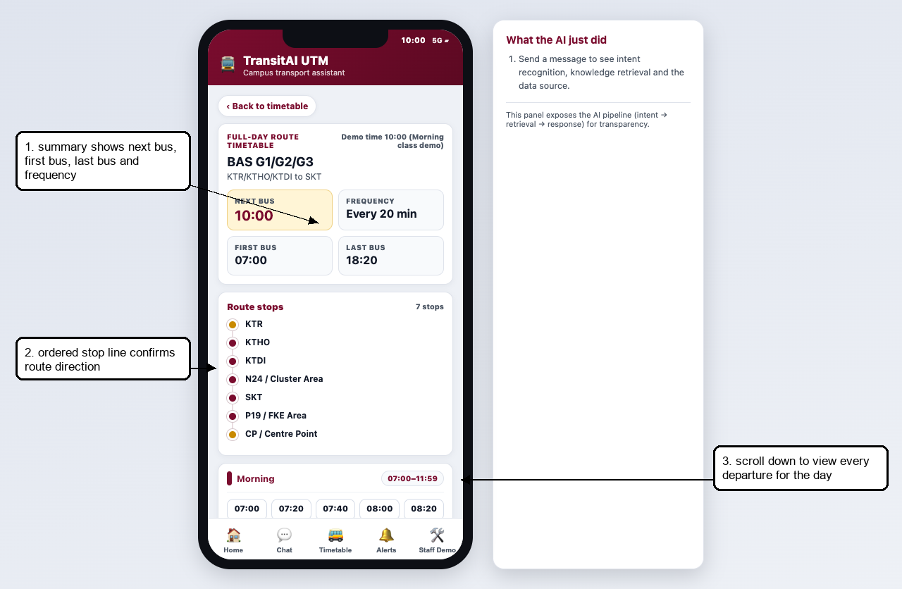
*Figure 4. Route timetable summary with route direction and key timing metrics.*

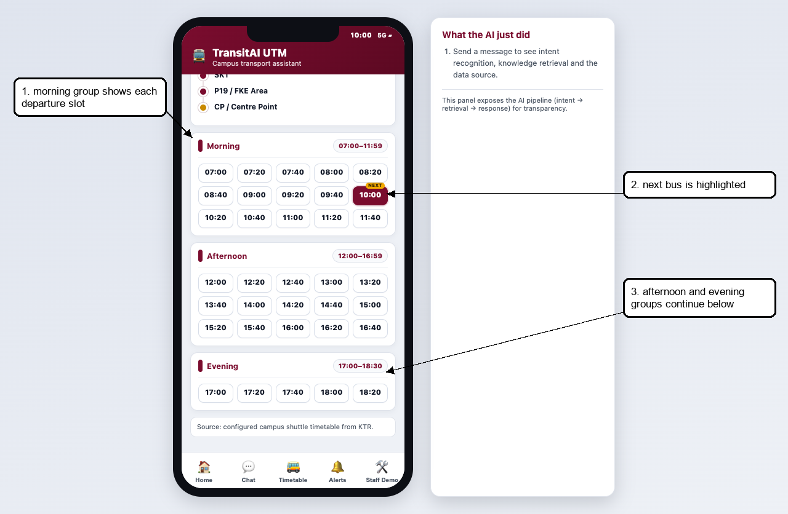
*Figure 5. Full-day departure grid with morning, afternoon and evening groups.*

### 4.4 Route Guidance

1. Ask: How do I get from KTDI to P19 FKE?
2. Show that the route engine uses the ordered stop sequence, so origin must appear before destination.
3. Point to the AI panel showing route_guidance intent and retrieved route/stop chunks.

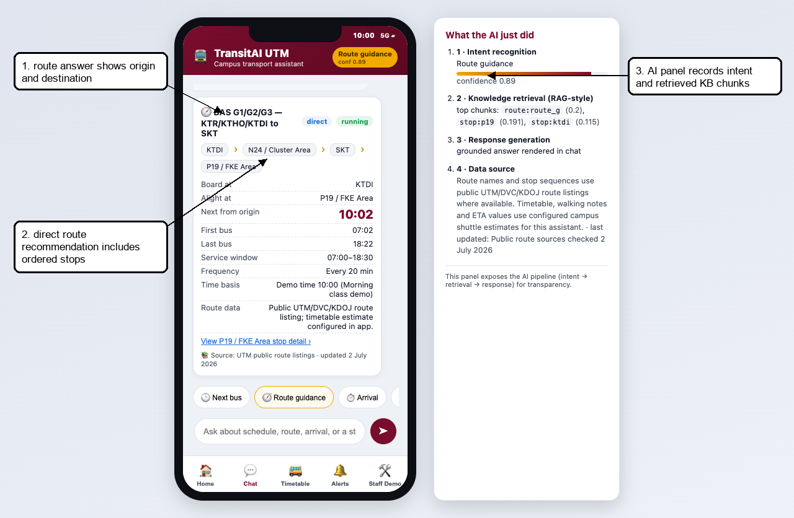
*Figure 6. Directional route guidance from KTDI to P19 / FKE Area.*

### 4.5 Bus Stop Detail

1. Ask: Where is the FC bus stop?
2. The app opens the Bus Stop Detail screen for N24 / Cluster Area.
3. Point to Data status to show uncertainty is clearly described instead of overstated.

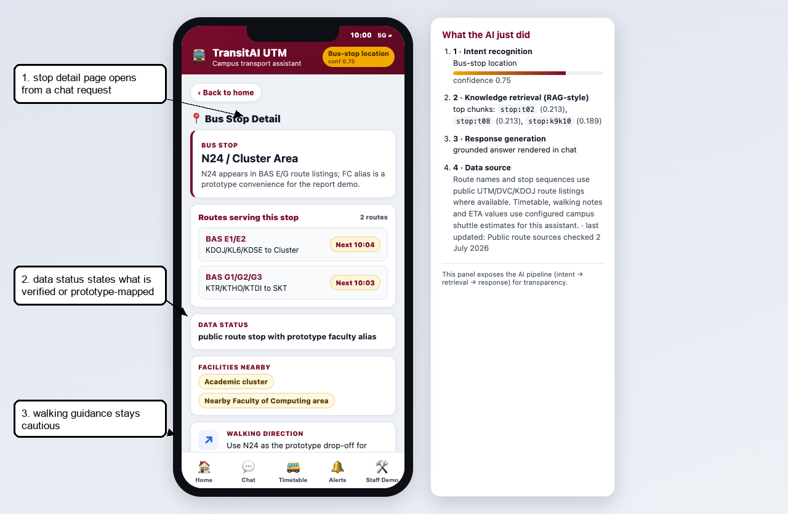
*Figure 7. Bus Stop Detail with routes, data status, facilities and walking guidance.*

### 4.6 Alerts and Subscription Filtering

1. In Staff Control Panel, delay a route that Ali is not subscribed to, such as BAS G.
2. Open Alerts. The route delay is hidden because Ali is not subscribed to that route.
3. Delay BAS A, which Ali is subscribed to. The alert becomes visible with scheduled time, ETA, service window and frequency.

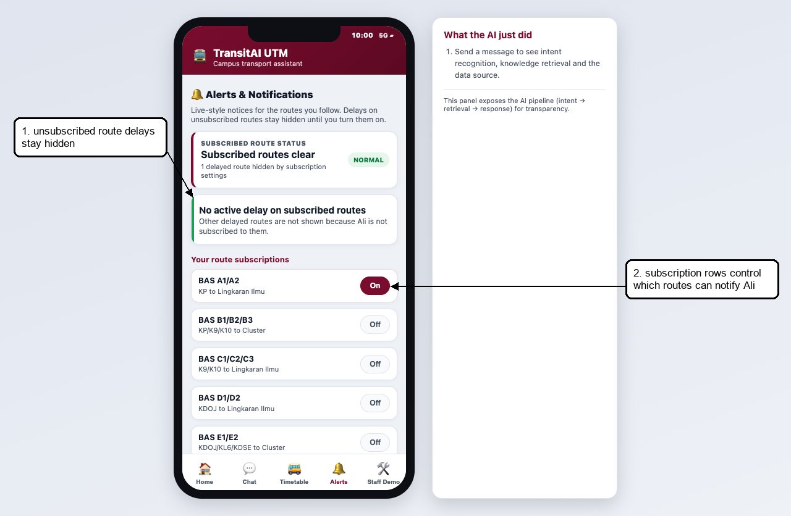
*Figure 8. Alerts screen proving unsubscribed route delays stay hidden.*

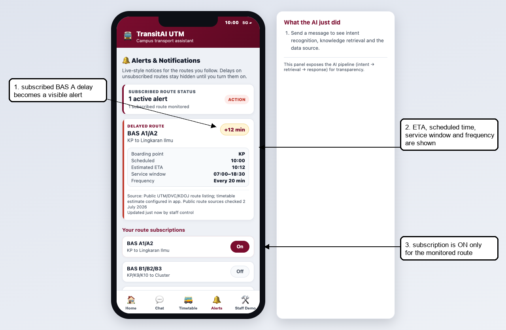
*Figure 9. Subscribed BAS A delay alert with ETA and route timing details.*

### 4.7 Feedback and Staff Report Follow-Up

1. Open Feedback / Escalate.
2. Select an issue type, enter details and submit the report.
3. Open Staff Control Panel. The same report appears under Reported issues for staff follow-up.

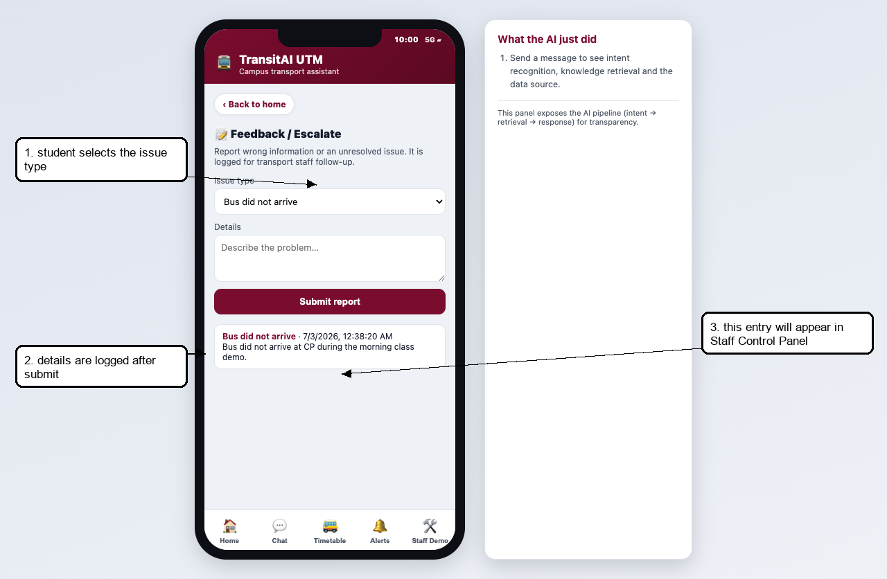
*Figure 10. Feedback report logged by the passenger.*

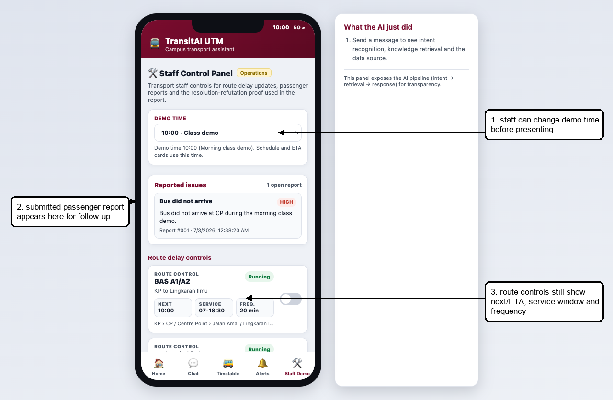
*Figure 11. Staff Control Panel showing the submitted passenger report.*

### 4.8 Staff Delay Proof

The Staff Control Panel is inside the prototype so the marker can trigger repeatable proof scenarios. The Word manual remains the separate admin deliverable.

1. Open Staff Control Panel.
2. Toggle BAS A1/A2 to delayed.
3. The app runs Resolution.prove('ali', 'route_a').
4. The proof panel derives the empty clause, proving NotifyUser(ali, route_a, delay).
5. Open Alerts to verify only the subscribed route notification is visible.

| Clause | Meaning |
| --- | --- |
| P1 WantsRouteAlert(ali, route_a) | Ali subscribes to BAS A route alerts. |
| P2 Delayed(route_a) | BAS A is currently marked delayed by staff. |
| P3 not Delayed(r) OR NeedDelayNotification(r) | A delayed route requires a delay notification. |
| P4 not WantsRouteAlert(u,r) OR not NeedDelayNotification(r) OR NotifyUser(u,r,delay) | A subscribed user is notified when a notification is needed. |
| Negated goal: not NotifyUser(ali, route_a, delay) | Resolution assumes the opposite and derives a contradiction. |

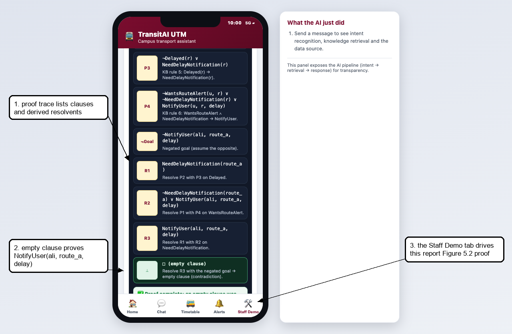
*Figure 12. Staff proof trace after BAS A is marked delayed.*

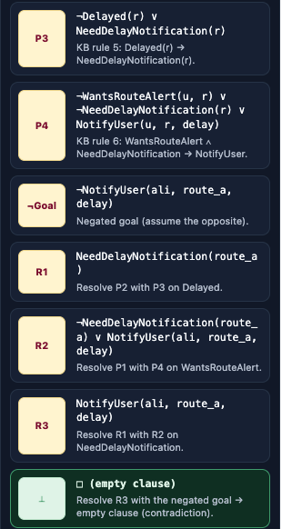
*Figure 13. Cropped proof trace showing the empty clause.*

## 5. Configuration Guide

### 5.1 Edit Stops

Stops are configured in KB.stops inside js/kb.js. Use aliases for names students actually type, and always include a status field that states whether the mapping is public, verified, or prototype-only.

```js
{ id: "p19", name: "P19 / FKE Area", aliases: ["p19", "fke", "electrical"], status: "public stop/area label with faculty alias", facilities: ["Faculty area", "Lecture halls"], walking: "Alight at P19 for the FKE-area prototype. Confirm the exact shelter in production." }
```

### 5.2 Edit Routes and Timetables

Routes are configured in KB.routes. The full-day timetable is generated from operating.start, operating.end and headway. This keeps the demo repeatable without pretending to use live GPS.

```js
{ id: "route_g", name: "BAS G1/G2/G3 - KTR/KTHO/KTDI to SKT", stops: ["ktr","ktho","ktdi","n24","skt","p19","cp"], operating: { start: "07:00", end: "18:30" }, headway: 20, source: "Public UTM/DVC/KDOJ route listing; timetable estimate configured in app." }
```

### 5.3 Tune Intents and Retrieval

- Edit CUES in js/intent.js when common student phrases are missing.
- Strong cues score 2; weak cues score 1. Avoid using overly common words as strong cues.
- Edit KB.faqs and route/stop aliases to improve RAG-style retrieval results.
- After changing intent cues, test schedule, route, arrival, bus-stop, alerts, feedback and FAQ queries.

### 5.4 Configure Demo Time

The default demo time is 10:00 so presentation does not depend on the real current time. Staff can switch to 08:00, 10:00, 13:00, 17:30, 20:30 or live device time from Staff Control Panel.

### 5.5 Configure Subscriptions and Delay Proof

- KB.subscriptions stores WantsRouteAlert(user, route) facts. The demo user is ali.
- KB.delayedRoutes stores Delayed(route) facts. Staff toggles update this list.
- Resolution.prove(user, route) only proves NotifyUser when both subscription and delay facts exist.
- If a delayed route is not subscribed, Alerts correctly hides the notification for Ali.

## 6. Troubleshooting

| Symptom | Likely cause | Fix |
| --- | --- | --- |
| Blank screen | Script load issue or missing file | Reload and ensure kb.js, intent.js, retriever.js, resolution.js, chat.js and app.js are loaded in index.html order. |
| Schedule says closed now | Demo/live clock outside service window | Staff Control Panel -> Demo time -> 10:00 for normal presentation. |
| Wrong route result | No directional route sequence serves origin before destination | Use CP as interchange or add a verified route sequence. Do not invent official data. |
| No delay alert appears | Ali is not subscribed to the delayed route | Turn on the route subscription or use BAS A, which is seeded for the proof. |
| Proof does not run | Route is not marked delayed or user lacks subscription | Toggle BAS A delayed and confirm KB.subscriptions contains ali/route_a. |
| Feedback not visible to staff | Staff Control Panel has not been opened/refreshed after submission | Open Staff Control Panel; renderStaffIssues() reads KB.feedbackLog. |
| Teacher asks if times are official | Prototype uses configured estimates | State clearly: route names/sequences are public-list aligned; timing/ETA/delay are POC estimates. |

## 7. Demo Checklist

- Open index.html or serve the prototype folder with python3 -m http.server 8000.
- Set Staff Control Panel -> Demo time to 10:00 before the main demo.
- Show Home, Chat schedule, Timetable search, route timetable, route guidance, bus-stop detail, Alerts, Feedback and Staff Control Panel.
- Submit a Feedback report and verify it appears under Staff Control Panel -> Reported issues.
- Toggle BAS A delayed, show the resolution proof, then open Alerts to show the subscribed notification.
- Say the data boundary clearly: public route names/sequences where available; timetable, ETA and delay values are configured POC estimates.
